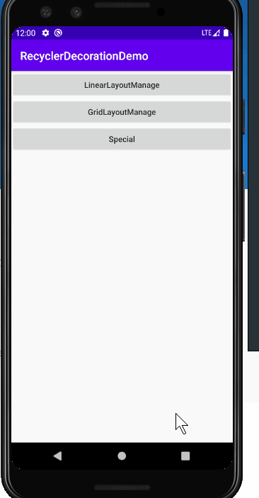

# RecyclerDecorationDemo
Android RecyclerView Item 分割线

- LinearDecoration 线性Layout分割
- GridDecoration 网格Layout分割



LayoutManage 为 GridLayoutManage 时常用字段
```kotlin
override fun onDrawOver(c: Canvas, parent: RecyclerView, state: RecyclerView.State) {
    super.onDrawOver(c, parent, state)
    val gridLayoutManager = parent.layoutManager as GridLayoutManager
    val spanCount = gridLayoutManager.spanCount
    val childCount = parent.childCount
    for (i in 0 until childCount) {
        val childView = parent.getChildAt(i)
        //item popsition
        val position = parent.getChildAdapterPosition(childView)
        //第几列 1,2,3 ...
        val column = (position % spanCount) + 1
        //第几行 1,2,3 ...
        val row = (position / spanCount) + 1
        //是否是第一列
        val isLeftSlid = column == 1
        //是否是最后一列
        val isRightSlid = column == spanCount
        //是否是两边
        val isSlid = isLeftSlid || isRightSlid
        //是否是偶数行
        val isEvenRow = (row % 2) == 0
        //是否是奇数行
        val isOddRow = (row % 2) == 1
        //一共多少行
        val rowCount = if (itemCount % spanCount != 0) {
            (itemCount / spanCount) + 1
        } else {
            itemCount / spanCount
        }
        //是否是第一行
        val isTop = 1 == row
        //是否是最后一行
        val isBottom = rowCount == row
        val centerHorizontal = (childView.right.toFloat() + childView.left.toFloat()) / 2
        val centerVertical = (childView.top.toFloat() + childView.bottom.toFloat()) / 2val childView = parent.getChildAt(i)
        
        //通过操作canvas->绘制item分割线
        ...
    }
}

```
#### onDrawOver 和 onDraw

onDrawOver不会别Item内容遮挡

onDraw会被遮挡


#### getItemOffsets

设置item之间间距 (对outRect设置边距)
```
override fun getItemOffsets(
         (outRect设置边距: Rect,
        view: View,
        parent: RecyclerView,
        state: RecyclerView.State
) {
    super.getItemOffsets(outRect, view, parent, state)
    outRect.set(horizontalLineWidth / 2, 0, horizontalLineWidth / 2, verticalLineHeight)
}
```
